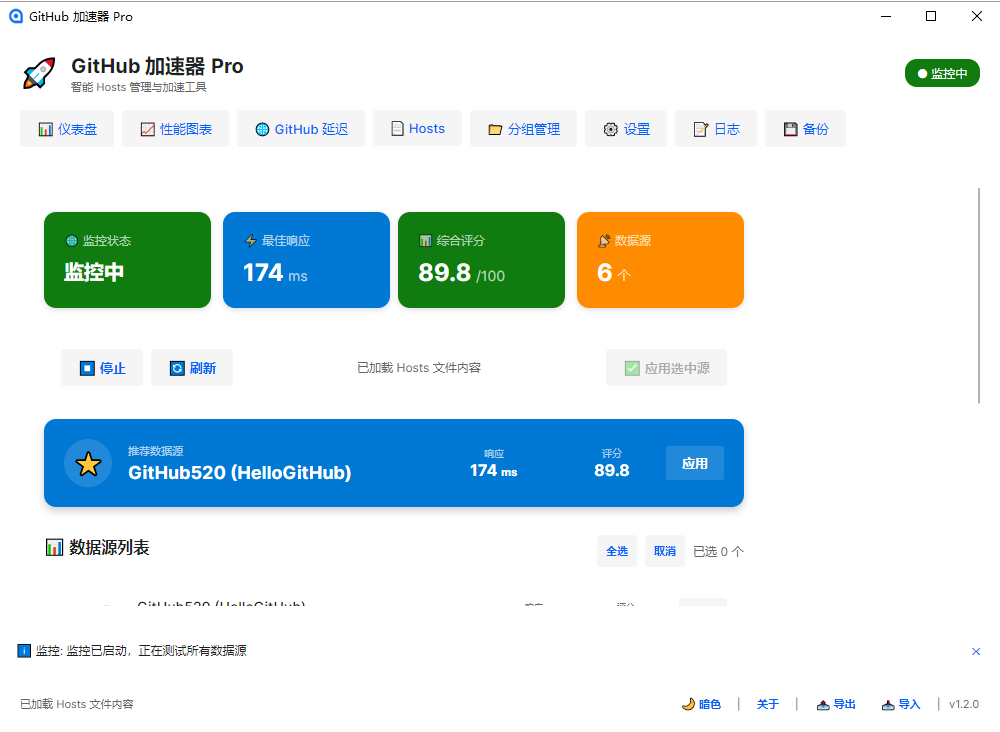
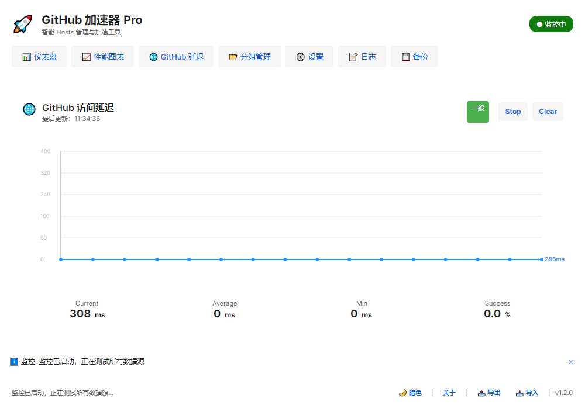
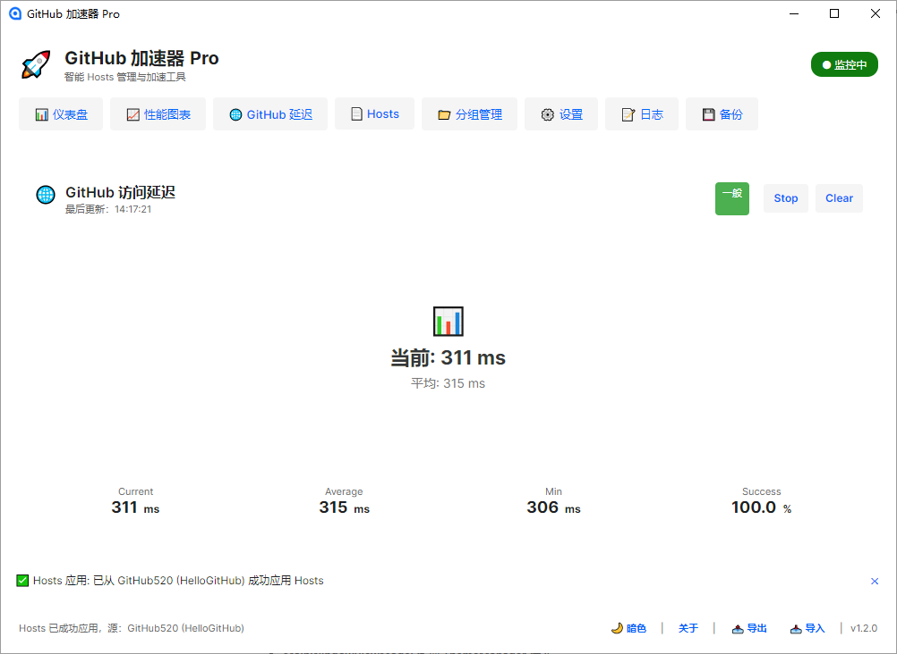

# GitHub 加速器 Pro

[](LICENSE)
[](https://dotnet.microsoft.com/)
[](https://www.microsoft.com/windows)

🚀 一款智能的 GitHub 访问加速工具，通过优化 Hosts 文件实现快速稳定的 GitHub 访问。

## ✨ 功能特性

- 🔥 **一键加速** - 自动获取并应用最优 Hosts 记录
- 📊 **性能监控** - 实时监控多个数据源的性能指标
- 🔄 **智能切换** - 根据健康评分自动选择最优数据源
- 📈 **可视化图表** - 直观展示性能数据和趋势
- 🌙 **主题切换** - 支持深色/浅色主题
- 💾 **数据备份** - 配置和数据安全备份
- 🔔 **系统托盘** - 最小化到托盘，后台运行
- ⚡ **开机自启** - Windows 开机自动启动

## 📸 截图





## 🚀 快速开始

### 系统要求

- Windows 10 1803+ 或 Windows 11
- .NET 10 Runtime

### 安装

1. 从 [Releases](https://github.com/jingshui127/GithubAccelerator/releases) 下载最新版本
2. 运行安装程序
3. 首次运行需要**管理员权限**

### 使用

1. 启动应用程序
2. 点击"刷新"获取最新数据源
3. 选择响应时间最短的数据源
4. 点击"应用"完成加速

## 📖 文档

| 文档 | 说明 |
|------|------|
| [项目计划](docs/PROJECT_PLAN.md) | 项目背景、目标、进度安排 |
| [需求规格说明书](docs/SRS.md) | 功能需求和非功能需求 |
| [设计文档](docs/SDD.md) | 架构设计和模块设计 |
| [测试报告](docs/TEST_REPORT.md) | 测试用例和测试结果 |
| [用户手册](docs/USER_MANUAL.md) | 安装和使用指南 |
| [维护手册](docs/MAINTENANCE_MANUAL.md) | 运维和故障排除 |

## 🏗️ 项目结构

```
GithubAccelerator/
├── GithubAccelerator.Core/       # 核心业务层
├── GithubAccelerator.UI/         # Avalonia UI 界面
├── GithubAccelerator/            # Windows Forms 界面
├── GithubAccelerator.Tests/      # 测试项目
└── docs/                         # 项目文档
```

## 🛠️ 技术栈

- **语言**: C# 10+
- **框架**: .NET 10
- **UI 框架**: Avalonia 12
- **架构模式**: MVVM
- **日志**: Serilog
- **测试**: xUnit

## 🔧 开发

### 环境准备

```bash
# 安装 .NET SDK
winget install Microsoft.DotNet.SDK.10

# 克隆仓库
git clone https://github.com/jingshui127/GithubAccelerator.git
cd GithubAccelerator

# 还原依赖
dotnet restore

# 构建项目
dotnet build

# 运行测试
dotnet test
```

### 运行

```bash
# 运行 UI 版本
dotnet run --project GithubAccelerator.UI

# 运行 CLI 版本
dotnet run --project GithubAccelerator
```

## 📝 变更日志

查看 [CHANGELOG.md](CHANGELOG.md) 了解版本更新历史。

## 🤝 贡献

欢迎提交 Issue 和 Pull Request！

1. Fork 本仓库
2. 创建功能分支 (`git checkout -b feature/AmazingFeature`)
3. 提交更改 (`git commit -m 'feat: add some feature'`)
4. 推送到分支 (`git push origin feature/AmazingFeature`)
5. 创建 Pull Request

## 📄 许可证

本项目采用 MIT 许可证 - 详见 [LICENSE](LICENSE) 文件。

## 🙏 致谢

- [FastGit](https://fastgit.org/) - 数据源支持
- [GitHub520](https://github.com/521xueweihan/GitHub520) - 数据源支持
- [Avalonia](https://avaloniaui.net/) - UI 框架

---

**⭐ 如果这个项目对你有帮助，请给一个 Star！**
